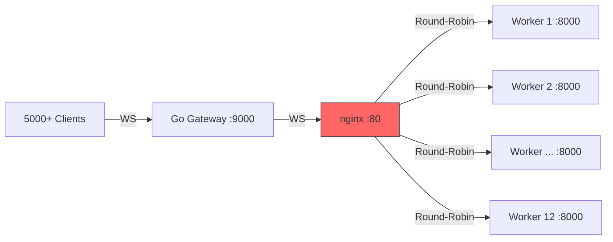
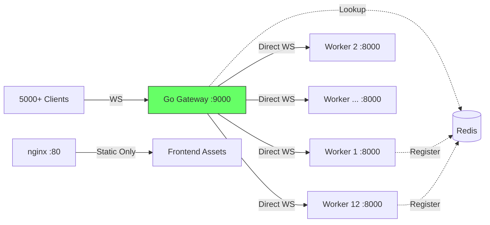
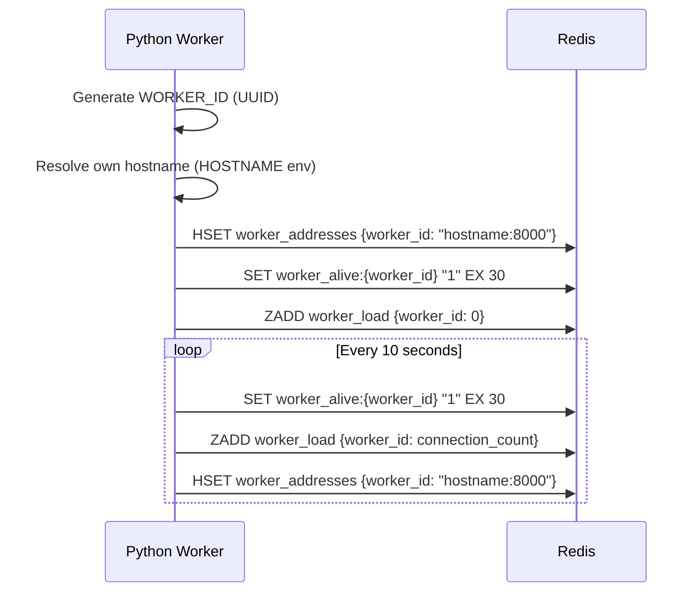
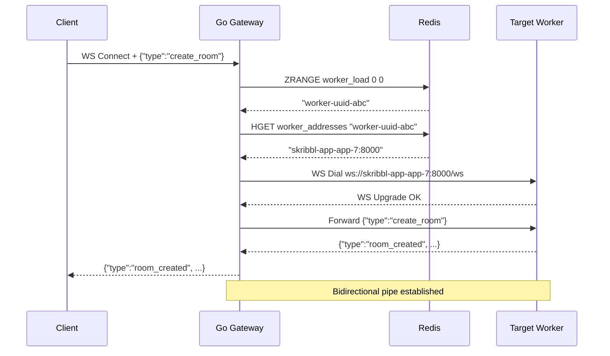
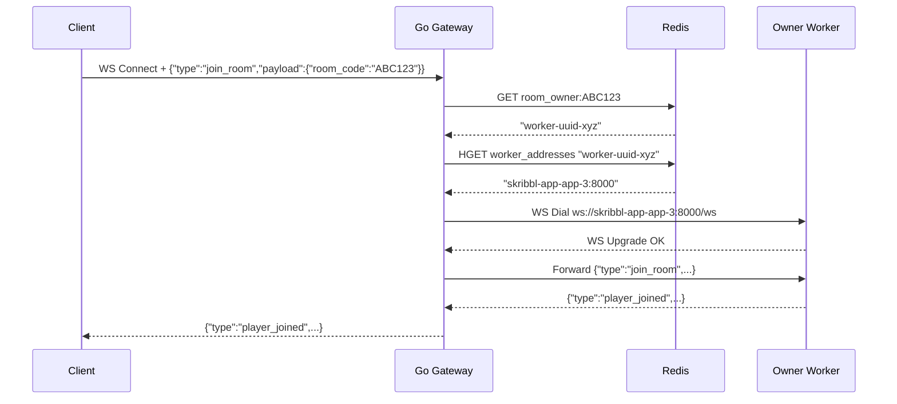
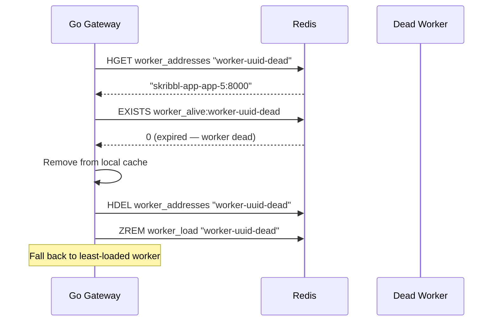

# Design Document: Direct Worker Routing

## Overview

The Go WebSocket gateway currently routes all backend connections through nginx, which becomes a bottleneck at 5000+ concurrent connections — queuing WebSocket upgrades for 8–16 seconds and RST-ing ~279 connections. This design eliminates nginx from the WebSocket path entirely by having the gateway resolve individual Python worker container addresses directly from Redis and connect to them over Docker's internal network on port 8000.

The core change is a service-discovery pattern: Python workers register their reachable hostname:port in Redis on startup, and the gateway's `workerIDToAddr()` resolves these addresses in real-time instead of always returning the single nginx backend address. nginx remains solely for serving static frontend assets.

## Architecture

### Current Architecture (Problem)



**Problem:** nginx queues 5000 concurrent WebSocket upgrade requests, causing 8–16s dial times and connection resets.

### Target Architecture (Solution)



**Result:** Gateway connects directly to the specific worker that owns the room, bypassing nginx entirely for WebSocket traffic.

## Sequence Diagrams

### Worker Registration on Startup



### Room Creation (Direct Routing)



### Room Join (Direct Routing)



### Worker Health Check (Stale Detection)



## Components and Interfaces

### Component 1: Worker Address Registry (Python — `redis_pubsub.py`)

**Purpose**: Workers register their reachable Docker hostname and port in Redis on startup and refresh it periodically via heartbeat.

**Interface**:
```python
async def register_worker_address(hostname: str, port: int = 8000) -> None:
    """Register this worker's reachable address in Redis.
    
    Called on startup and every heartbeat cycle. Uses HOSTNAME env var
    from Docker (container name like 'skribbl-app-app-7').
    """
    ...

async def unregister_worker_address() -> None:
    """Remove this worker's address from Redis on shutdown."""
    ...

async def get_worker_address(worker_id: str) -> Optional[str]:
    """Lookup a worker's reachable address by its ID.
    
    Returns 'hostname:port' or None if worker not registered.
    """
    ...

async def heartbeat_worker() -> None:
    """Refresh the worker's alive key with TTL.
    
    Called every 10 seconds. If not refreshed within 30s,
    the gateway considers the worker dead.
    """
    ...
```

**Responsibilities**:
- Store worker address in Redis hash `worker_addresses` (worker_id → hostname:port)
- Maintain liveness key `worker_alive:{worker_id}` with 30-second TTL
- Clean up on graceful shutdown (SIGTERM)
- Include address refresh in the existing periodic load reporter

### Component 2: Direct Address Resolution (Go — `gateway/main.go`)

**Purpose**: Replace the current `workerIDToAddr()` stub with actual Redis-backed address resolution, with a local cache to avoid per-connection Redis lookups.

**Interface**:
```go
// WorkerResolver caches worker addresses with TTL-based invalidation.
type WorkerResolver struct {
    redis     *redis.Client
    cache     sync.Map         // map[workerID]cachedAddr
    cacheTTL  time.Duration    // how long to trust cached addresses
}

type cachedAddr struct {
    address   string
    fetchedAt time.Time
}

// Resolve returns the reachable address for a worker ID.
// Uses local cache (5s TTL) before hitting Redis.
func (wr *WorkerResolver) Resolve(ctx context.Context, workerID string) (string, error)

// IsAlive checks if a worker's liveness key exists in Redis.
func (wr *WorkerResolver) IsAlive(ctx context.Context, workerID string) (bool, error)

// Evict removes a worker from the local cache (e.g., after dial failure).
func (wr *WorkerResolver) Evict(workerID string)

// StartCleanup runs a background goroutine that prunes stale cache entries.
func (wr *WorkerResolver) StartCleanup(ctx context.Context)
```

**Responsibilities**:
- Resolve worker_id → hostname:port from Redis hash `worker_addresses`
- Cache resolutions locally for 5 seconds to avoid Redis per-connection overhead
- Evict cache entries on dial failure (triggers re-fetch from Redis)
- Verify worker liveness via `worker_alive:{worker_id}` key existence
- Background goroutine prunes expired entries every 10 seconds

### Component 3: Fallback and Retry Strategy (Go — `gateway/main.go`)

**Purpose**: Handle cases where a resolved worker is unreachable (crashed, scaling down) by falling back to another healthy worker.

**Interface**:
```go
// dialWithFallback attempts to connect to the target worker.
// If the target is dead, evicts from cache and retries with the next best worker.
func (gw *Gateway) dialWithFallback(ctx context.Context, targetWorkerID string, firstMsg []byte) (*websocket.Conn, error)
```

**Responsibilities**:
- Attempt WebSocket dial to resolved worker address
- On dial failure: evict from cache, check liveness, try next least-loaded worker
- Maximum 2 fallback attempts before returning error to client
- Log dial failures with worker_id for operational visibility

### Component 4: Docker Networking Configuration (`docker-compose.yml`)

**Purpose**: Ensure all services share a network where the gateway can reach workers by their container hostname.

**Responsibilities**:
- Place gateway and app services on the same Docker network
- Workers are reachable via container hostnames (e.g., `skribbl-app-app-1:8000`)
- Expose gateway port 9000 to host (client-facing)
- nginx no longer needs to proxy WebSocket traffic to workers
- Workers keep port 8000 exposed internally (not to host)

## Data Models

### Redis Keys

| Key Pattern | Type | Value | TTL | Purpose |
|-------------|------|-------|-----|---------|
| `worker_addresses` | Hash | `{worker_id: "hostname:8000"}` | None (cleaned on shutdown) | Worker discovery |
| `worker_alive:{worker_id}` | String | `"1"` | 30s | Liveness detection |
| `worker_load` | Sorted Set | `{worker_id: connection_count}` | 120s (existing) | Load-aware routing |
| `room_owner:{room_code}` | String | `worker_id` | 3600s (existing) | Room → worker mapping |
| `room_workers` | Hash | `{room_code: worker_id}` | None (existing) | Room → worker fallback |

### Gateway Local Cache

```go
// In-memory address cache to avoid Redis round-trip per connection
type addressCache struct {
    entries sync.Map // map[string]*cacheEntry
}

type cacheEntry struct {
    Address   string
    FetchedAt time.Time
    Alive     bool
}

const cacheTTL = 5 * time.Second
```

### Worker Registration Payload

```python
# Stored in Redis hash "worker_addresses"
# Key: WORKER_ID (UUID string)
# Value: "container_hostname:8000"
#
# Example: {"a3f2c1d4-...": "skribbl-app-app-7:8000"}
```

## Key Functions with Formal Specifications

### Function 1: `register_worker_address()` (Python)

```python
async def register_worker_address(hostname: str, port: int = 8000) -> None:
    """Register this worker's reachable network address in Redis."""
    if _redis_client is None:
        return
    address = f"{hostname}:{port}"
    await _redis_client.hset("worker_addresses", WORKER_ID, address)
    await _redis_client.set(f"worker_alive:{WORKER_ID}", "1", ex=30)
```

**Preconditions:**
- `_redis_client` is connected and healthy
- `hostname` is a valid Docker container hostname (non-empty, DNS-resolvable within the Docker network)
- `port` is a valid port number (1–65535), defaults to 8000

**Postconditions:**
- `HGET worker_addresses {WORKER_ID}` returns `"{hostname}:{port}"`
- `EXISTS worker_alive:{WORKER_ID}` returns 1
- TTL on `worker_alive:{WORKER_ID}` is ≤ 30 seconds
- If Redis is None, no-op (single-worker mode)

### Function 2: `WorkerResolver.Resolve()` (Go)

```go
func (wr *WorkerResolver) Resolve(ctx context.Context, workerID string) (string, error) {
    // Check local cache first
    if entry, ok := wr.cache.Load(workerID); ok {
        cached := entry.(*cacheEntry)
        if time.Since(cached.FetchedAt) < wr.cacheTTL {
            return cached.Address, nil
        }
    }

    // Cache miss or stale — fetch from Redis
    addr, err := wr.redis.HGet(ctx, "worker_addresses", workerID).Result()
    if err == redis.Nil {
        return "", fmt.Errorf("worker %s not registered", workerID)
    }
    if err != nil {
        return "", fmt.Errorf("redis lookup failed: %w", err)
    }

    // Update cache
    wr.cache.Store(workerID, &cacheEntry{
        Address:   addr,
        FetchedAt: time.Now(),
        Alive:     true,
    })

    return addr, nil
}
```

**Preconditions:**
- `ctx` is not cancelled
- `workerID` is a non-empty string (UUID format)
- `wr.redis` is a connected Redis client

**Postconditions:**
- Returns the address string `"hostname:port"` if worker is registered
- Returns error if worker is not in Redis or Redis is unreachable
- Cache is populated/refreshed on successful Redis lookup
- If cache hit within TTL, no Redis call is made (O(1) local lookup)

**Loop Invariants:** N/A (no loops)

### Function 3: `dialWithFallback()` (Go)

```go
func (gw *Gateway) dialWithFallback(ctx context.Context, workerID string, firstMsg []byte) (*websocket.Conn, string, error) {
    attempts := []string{workerID}
    
    for i, wID := range attempts {
        addr, err := gw.resolver.Resolve(ctx, wID)
        if err != nil {
            // Worker not registered — try fallback
            if i == 0 {
                fallback := gw.leastLoadedWorker()
                if fallback != "" && fallback != workerID {
                    attempts = append(attempts, fallback)
                }
            }
            continue
        }

        // Check liveness before dialing
        alive, _ := gw.resolver.IsAlive(ctx, wID)
        if !alive {
            gw.resolver.Evict(wID)
            if i == 0 {
                fallback := gw.leastLoadedWorker()
                if fallback != "" {
                    attempts = append(attempts, fallback)
                }
            }
            continue
        }

        // Attempt dial
        backendURL := url.URL{Scheme: "ws", Host: addr, Path: "/ws"}
        conn, _, err := gw.dialer.DialContext(ctx, backendURL.String(), nil)
        if err != nil {
            gw.resolver.Evict(wID)
            log.Printf("[gateway] DIAL_FAILED worker=%s addr=%s err=%v", wID, addr, err)
            if i == 0 {
                fallback := gw.leastLoadedWorker()
                if fallback != "" {
                    attempts = append(attempts, fallback)
                }
            }
            continue
        }

        return conn, addr, nil
    }

    return nil, "", fmt.Errorf("all workers unreachable after %d attempts", len(attempts))
}
```

**Preconditions:**
- `workerID` is a valid worker identifier from Redis room lookup
- `ctx` has a reasonable deadline (≤ 10 seconds)
- `gw.resolver` is initialized and connected to Redis

**Postconditions:**
- Returns a connected `*websocket.Conn` to a healthy worker, OR error if all attempts fail
- On success: the returned connection is ready for bidirectional framing
- On dial failure: worker is evicted from cache, fallback to least-loaded worker attempted
- Maximum 2 dial attempts total (primary + 1 fallback)

**Loop Invariants:**
- Each iteration targets a distinct worker ID
- Failed workers are evicted from the cache before the next iteration
- The `attempts` slice grows by at most 1 per iteration

### Function 4: `report_worker_load()` (Python — enhanced)

```python
async def report_worker_load(room_count: int, connection_count: int) -> None:
    """Report load AND refresh address registration (combined heartbeat)."""
    if _redis_client is None:
        return
    
    # Existing: report load to sorted set
    await _redis_client.zadd("worker_load", {WORKER_ID: connection_count})
    await _redis_client.hset("worker_rooms", WORKER_ID, room_count)
    await _redis_client.expire("worker_load", 120)
    
    # NEW: refresh liveness and address
    hostname = os.environ.get("HOSTNAME", "localhost")
    address = f"{hostname}:8000"
    await _redis_client.hset("worker_addresses", WORKER_ID, address)
    await _redis_client.set(f"worker_alive:{WORKER_ID}", "1", ex=30)
```

**Preconditions:**
- `_redis_client` is connected
- `room_count` ≥ 0, `connection_count` ≥ 0
- `HOSTNAME` environment variable is set (Docker sets this to container hostname)

**Postconditions:**
- `worker_load` sorted set updated with current connection count
- `worker_addresses` hash updated with current hostname:port
- `worker_alive:{WORKER_ID}` refreshed with 30s TTL
- If Redis is unavailable, no-op

## Algorithmic Pseudocode

### Connection Routing Algorithm

```pascal
ALGORITHM routeConnection(gateway, firstMessage)
INPUT: gateway state, raw first WebSocket message from client
OUTPUT: connected backend WebSocket OR error

BEGIN
  msg ← parseJSON(firstMessage)
  
  CASE msg.type OF
    "create_room":
      workerID ← gateway.redis.ZRANGE("worker_load", 0, 0)  // least loaded
      
    "join_room", "reconnect":
      roomCode ← msg.payload.room_code
      workerID ← gateway.redis.GET("room_owner:" + roomCode)
      IF workerID IS NULL THEN
        workerID ← gateway.redis.HGET("room_workers", roomCode)  // fallback
      END IF
      
    DEFAULT:
      workerID ← NULL
  END CASE
  
  IF workerID IS NULL THEN
    RETURN Error("NO_BACKEND")
  END IF
  
  // Resolve address with cache + fallback
  connection ← dialWithFallback(workerID)
  RETURN connection
END
```

### Address Resolution with Cache

```pascal
ALGORITHM resolveWorkerAddress(resolver, workerID)
INPUT: resolver with local cache, workerID string
OUTPUT: address string "hostname:port" OR error

BEGIN
  // Step 1: Check local cache
  entry ← resolver.cache[workerID]
  IF entry IS NOT NULL AND (now() - entry.fetchedAt) < 5 seconds THEN
    RETURN entry.address
  END IF
  
  // Step 2: Fetch from Redis
  address ← HGET("worker_addresses", workerID)
  IF address IS NULL THEN
    RETURN Error("worker not registered")
  END IF
  
  // Step 3: Update cache
  resolver.cache[workerID] ← {address, fetchedAt: now(), alive: true}
  RETURN address
END
```

### Worker Liveness Detection

```pascal
ALGORITHM isWorkerAlive(resolver, workerID)
INPUT: resolver, workerID to check
OUTPUT: boolean

BEGIN
  alive ← EXISTS("worker_alive:" + workerID)
  IF NOT alive THEN
    // Worker missed heartbeat (>30s) — clean up
    HDEL("worker_addresses", workerID)
    ZREM("worker_load", workerID)
    resolver.cache.evict(workerID)
  END IF
  RETURN alive
END
```

### Dial with Fallback

```pascal
ALGORITHM dialWithFallback(gateway, primaryWorkerID)
INPUT: gateway state, primary target worker ID
OUTPUT: WebSocket connection OR error

BEGIN
  attempts ← [primaryWorkerID]
  
  FOR EACH workerID IN attempts DO
    ASSERT |attempts| ≤ 2  // max 2 total attempts
    
    address ← resolveWorkerAddress(gateway.resolver, workerID)
    IF address IS Error THEN
      IF workerID = primaryWorkerID THEN
        fallback ← ZRANGE("worker_load", 0, 0)  // least loaded
        IF fallback ≠ NULL AND fallback ≠ primaryWorkerID THEN
          attempts.append(fallback)
        END IF
      END IF
      CONTINUE
    END IF
    
    alive ← isWorkerAlive(gateway.resolver, workerID)
    IF NOT alive THEN
      // Same fallback logic
      CONTINUE
    END IF
    
    connection ← WebSocket.Dial("ws://" + address + "/ws", timeout=5s)
    IF connection IS Error THEN
      gateway.resolver.evict(workerID)
      IF workerID = primaryWorkerID THEN
        fallback ← ZRANGE("worker_load", 0, 0)
        IF fallback ≠ NULL THEN
          attempts.append(fallback)
        END IF
      END IF
      CONTINUE
    END IF
    
    RETURN connection
  END FOR
  
  RETURN Error("all workers unreachable")
END
```

**Loop Invariants:**
- Each iteration processes a distinct worker ID
- `|attempts|` ≤ 2 at all times
- Failed workers have been evicted from cache

## Example Usage

### Python Worker Startup (enhanced `lifespan`)

```python
@asynccontextmanager
async def lifespan(app: FastAPI):
    await redis_pubsub.init_redis(room_manager.handle_redis_message)
    
    # NEW: Register address on startup
    hostname = os.environ.get("HOSTNAME", "localhost")
    await redis_pubsub.register_worker_address(hostname, 8000)
    logger.info("Worker registered: %s:%d (id=%s)", hostname, 8000, redis_pubsub.get_worker_id())

    # Existing periodic load reporter (now also refreshes address)
    async def _report_load_periodically():
        while True:
            try:
                room_count = len([r for r in room_manager.rooms.values() if not r.is_proxy])
                connection_count = sum(...)
                await redis_pubsub.report_worker_load(room_count, connection_count)
            except Exception as e:
                logger.debug("Load report failed: %s", e)
            await asyncio.sleep(10)

    load_task = asyncio.create_task(_report_load_periodically())
    yield

    # Shutdown: unregister address
    load_task.cancel()
    await redis_pubsub.unregister_worker_address()
    await redis_pubsub.shutdown_redis()
```

### Go Gateway Initialization (enhanced `main()`)

```go
func main() {
    flag.Parse()
    
    // ... Redis init (existing) ...
    
    resolver := &WorkerResolver{
        redis:    rdb,
        cacheTTL: 5 * time.Second,
    }
    go resolver.StartCleanup(context.Background())
    
    gw := &Gateway{
        backends: backends,  // kept as fallback
        redis:    rdb,
        resolver: resolver,
        dialer: websocket.Dialer{
            HandshakeTimeout: 5 * time.Second,  // was 30s (nginx needed it)
            ReadBufferSize:   4096,
            WriteBufferSize:  4096,
        },
    }
    // ...
}
```

### Updated `workerIDToAddr()` → `resolver.Resolve()`

```go
// BEFORE (always returned nginx address):
func (gw *Gateway) workerIDToAddr(workerID string) string {
    if len(gw.backends) > 0 {
        return gw.backends[0]
    }
    return ""
}

// AFTER (resolves real container address from Redis):
func (gw *Gateway) workerIDToAddr(workerID string) string {
    ctx, cancel := context.WithTimeout(context.Background(), 2*time.Second)
    defer cancel()
    
    addr, err := gw.resolver.Resolve(ctx, workerID)
    if err != nil {
        log.Printf("[gateway] RESOLVE_FAILED worker=%s err=%v", workerID, err)
        return ""
    }
    return addr
}
```

### Docker Compose (updated)

```yaml
services:
  gateway:
    build: ./gateway
    ports:
      - "9000:9000"
    environment:
      - REDIS_URL=redis://redis:6379
      - BACKENDS=app:8000  # fallback only
    depends_on:
      redis:
        condition: service_healthy
    networks:
      - skribbl-net

  app:
    build: .
    environment:
      - REDIS_URL=redis://redis:6379
    depends_on:
      redis:
        condition: service_healthy
    expose:
      - "8000"
    networks:
      - skribbl-net

  nginx:
    image: nginx:alpine
    ports:
      - "80:80"
    volumes:
      - ./nginx-static.conf:/etc/nginx/nginx.conf:ro
    depends_on:
      - app
    networks:
      - skribbl-net

  redis:
    image: redis:7-alpine
    ports:
      - "6379:6379"
    healthcheck:
      test: ["CMD", "redis-cli", "ping"]
      interval: 5s
      timeout: 3s
      retries: 5
    networks:
      - skribbl-net

networks:
  skribbl-net:
    driver: bridge
```

## Correctness Properties

*A property is a characteristic or behavior that should hold true across all valid executions of a system — essentially, a formal statement about what the system should do. Properties serve as the bridge between human-readable specifications and machine-verifiable correctness guarantees.*

### Property 1: Address Registration Round-Trip

*For any* valid hostname and port, registering a worker address and then resolving that worker's address SHALL return the same `"{hostname}:{port}"` string that was registered.

**Validates: Requirements 1.1, 2.4**

### Property 2: Cache Freshness Guarantee

*For any* worker ID with an Address_Cache entry younger than 5 seconds, resolution SHALL return the cached address without querying Redis. *For any* cache entry older than 5 seconds, resolution SHALL fetch a fresh value from Redis and update the cache.

**Validates: Requirements 2.1, 2.2, 2.3, 2.4**

### Property 3: Least-Loaded Routing for Room Creation

*For any* set of workers with distinct load scores in the `worker_load` sorted set, a `create_room` routing decision SHALL select the worker with the minimum load score.

**Validates: Requirement 3.1**

### Property 4: Deterministic Owner Routing for Room Join

*For any* room code with a registered Room_Owner worker that is alive, a `join_room` routing decision SHALL route the connection to that specific owner worker and no other.

**Validates: Requirements 3.2, 3.3**

### Property 5: Fallback Bounded Retry with No Duplicate Attempts

*For any* sequence of dial attempts in `dialWithFallback`, the system SHALL attempt at most 2 distinct worker IDs, and no worker ID SHALL be attempted more than once.

**Validates: Requirements 4.1, 4.2, 4.3**

### Property 6: Dead Worker Cleanup

*For any* worker whose Liveness_Key has expired, a liveness check SHALL remove that worker's entry from the Worker_Registry, the `worker_load` sorted set, and the Address_Cache.

**Validates: Requirements 5.2, 5.3**

### Property 7: Heartbeat Atomicity

*For any* call to the combined load-reporting function, the worker_load sorted set, Worker_Registry hash, and Liveness_Key SHALL all be updated in the same heartbeat cycle.

**Validates: Requirements 7.1, 7.2**

### Property 8: Redis Failure Graceful Degradation

*For any* connection attempt where Redis is unreachable during address resolution, the Gateway SHALL fall back to routing among the statically configured backend addresses rather than returning an error.

**Validates: Requirements 9.1, 9.2, 9.4**

## Error Handling

### Error Scenario 1: Worker Crashes Without Graceful Shutdown

**Condition**: Worker process killed (SIGKILL, OOM) — no cleanup runs.
**Response**: The `worker_alive:{worker_id}` key expires after 30 seconds. Gateway's `IsAlive()` check returns false.
**Recovery**: Gateway evicts the dead worker from cache, cleans up its Redis entries (`worker_addresses`, `worker_load`), and routes to next least-loaded worker. Room state is lost for rooms on that worker (existing behavior — no state persistence yet).

### Error Scenario 2: Redis Temporarily Unavailable

**Condition**: Redis goes down for a few seconds during a connection attempt.
**Response**: `Resolve()` returns error. Gateway falls back to round-robin among known backend addresses (existing `gw.backends` list).
**Recovery**: Once Redis is back, new connections resume normal resolution. Cached addresses remain valid for up to 5 seconds after Redis failure.

### Error Scenario 3: Stale Room Registry (Room Moved/Deleted)

**Condition**: Client tries to join a room whose owner has died and the room no longer exists.
**Response**: Gateway resolves the dead worker, dial fails, fallback worker doesn't have the room either.
**Recovery**: Gateway sends `ROOM_NOT_FOUND` error to client. Client shows "Room not found" UI. Redis TTL (3600s on `room_owner`) eventually cleans up the stale entry, but `worker_alive` check (30s) catches it faster.

### Error Scenario 4: Network Partition Between Gateway and Worker

**Condition**: Gateway can reach Redis but not a specific worker container.
**Response**: Dial times out after 5 seconds (reduced from 30s since no nginx queue).
**Recovery**: Gateway evicts the worker from cache and falls back to next healthy worker. If the worker was actually alive (network blip), its heartbeat continues in Redis and it becomes routable again after the cache eviction + re-resolve cycle (≤ 5s).

### Error Scenario 5: All Workers Overloaded

**Condition**: All 12 workers at maximum capacity, `worker_load` scores all high.
**Response**: Gateway still routes to least-loaded (lowest score wins), distributing evenly.
**Recovery**: No special handling needed — the sorted set naturally picks the best option. If all workers are truly unreachable, `dialWithFallback` exhausts attempts and returns `BACKEND_UNAVAILABLE` to client.

## Testing Strategy

### Unit Testing Approach

**Python side:**
- Test `register_worker_address()` with mocked Redis — verify HSET and SET calls
- Test `unregister_worker_address()` — verify HDEL and DEL calls
- Test `report_worker_load()` includes address refresh (new behavior)
- Test startup/shutdown lifecycle registers and unregisters correctly

**Go side:**
- Test `WorkerResolver.Resolve()` with mock Redis — cache hit, cache miss, cache expired
- Test `WorkerResolver.IsAlive()` — alive, dead, Redis error
- Test `WorkerResolver.Evict()` — removes from local cache
- Test `dialWithFallback()` — success, primary fails + fallback succeeds, all fail
- Test `routeConnection()` — create_room routes to least-loaded, join_room routes to owner

### Property-Based Testing Approach

**Property Test Library**: Hypothesis (Python), testing/quick (Go)

**Python properties:**
- For any valid hostname and port, `register_worker_address` followed by `get_worker_address` returns the same address
- For any worker that hasn't heartbeated in >30s, `worker_alive` key does not exist

**Go properties:**
- For any sequence of Resolve/Evict operations, cache never returns an address older than `cacheTTL`
- For any worker ID in the `worker_load` sorted set, `Resolve` returns an address or an error (never panics)
- Dial fallback never attempts the same worker ID twice

### Integration Testing Approach

- Docker Compose with 3 scaled workers + gateway + Redis
- Verify: gateway dials workers directly (tcpdump shows no nginx in path)
- Verify: killing a worker → gateway routes to another within 30s
- Verify: creating a room → joined via same worker (room affinity maintained)
- Load test: 5000 VUs with k6 — 100% connection success, <500ms p95 dial time

## Performance Considerations

| Metric | Before (nginx) | After (direct) | Why |
|--------|----------------|-----------------|-----|
| Dial time p50 | 2–4s | <10ms | No nginx connection queue |
| Dial time p95 | 8–16s | <100ms | Direct TCP to worker container |
| Connection success rate | 48% (at 5000 VUs) | ~100% | No RSTs from nginx backpressure |
| Redis overhead per conn | 1 GET (room lookup) | 1–2 GET + 1 HGET | Address resolution added |
| Memory (gateway) | ~0 | +2MB (cache for 12 workers) | Negligible |
| Latency (message relay) | +0.5ms (nginx hop) | 0ms | Direct pipe |

**Cache sizing:** With 12 workers and 5-second TTL, the cache holds ≤12 entries at ~100 bytes each = negligible memory.

**Redis load:** Address lookups are amortized by the 5-second cache. With 5000 connections over 60 seconds, worst case is ~1000 Redis HGET/s (well within single-instance capacity of 100K ops/s).

## Security Considerations

- **Internal network only**: Worker containers do NOT expose port 8000 to the host. Only the gateway (port 9000) is externally accessible.
- **No auth between gateway and workers**: Acceptable because they share a Docker network. In production (K8s), use network policies to restrict worker access to gateway pods only.
- **Redis is internal**: No authentication configured for local dev. In production, use Redis AUTH and TLS.
- **No client IP forwarding needed**: Workers don't make access decisions based on client IP (game logic is room-code-based).

## Dependencies

| Dependency | Component | Purpose |
|------------|-----------|---------|
| `github.com/redis/go-redis/v9` | Gateway | Redis address lookups (already used) |
| `github.com/gorilla/websocket` | Gateway | WebSocket connections (already used) |
| `redis.asyncio` | Python workers | Address registration (already used) |
| Docker internal DNS | Infrastructure | Container hostname resolution |
| `HOSTNAME` env var | Python workers | Docker-provided container hostname |


## Migration Phases

This feature is Phase 1 of a two-phase gateway evolution. Both phases are additive — Phase 2 builds on Phase 1's service discovery infrastructure.

### Phase 1: Direct Worker Routing (This Spec)

**Goal:** Eliminate nginx from the WebSocket path. Gateway connects directly to worker containers via Redis-based service discovery.

**Architecture:**
```
Client ──WS──► Go Gateway ──WS (direct)──► Python Worker (1 conn per player)
```

**What it solves:**
- nginx connection queuing (8–16s dial time → <100ms)
- nginx RST-ing connections under burst (48% → ~100% success)
- Single point of failure in WebSocket path

**What it doesn't solve:**
- Python still holds 1 WebSocket per player (~500 connection limit per worker)
- At 10K+ users, you'd need 20+ Python workers
- Each message still traverses a full WebSocket frame decode/encode on Python

**Ceiling:** ~6000 concurrent connections (12 workers × 500 each)

---

### Phase 2: gRPC Connection Multiplexing (Future)

**Goal:** Eliminate per-player WebSocket connections on Python workers. Gateway aggregates N clients per room into a single gRPC stream to the owning worker.

**Architecture:**
```
Client ──WS──► Go Gateway ──gRPC stream (1 per room)──► Python Game Logic
```

**What changes from Phase 1:**
- Gateway no longer opens a WebSocket per player to the backend
- Instead: 1 gRPC bidirectional stream per room (5 players share 1 backend connection)
- Python workers run a gRPC servicer instead of (or alongside) the WebSocket handler
- Broadcasts flow back via the gRPC stream — gateway fans out to client WebSockets

**What carries over from Phase 1 (unchanged):**
- Redis service discovery (`worker_addresses`, `worker_alive`)
- `WorkerResolver` with cache and liveness checks
- `dialWithFallback` logic (just dials gRPC instead of WebSocket)
- Load reporting and least-loaded routing
- Docker networking and container hostname resolution
- Coordination endpoints (`/rooms/{index}`)
- All gateway metrics and logging

**What it solves:**
- Python connection bottleneck (1 gRPC stream per room vs 5 WebSockets per room)
- 12 workers can now handle 125K rooms (vs 6000 connections)
- Message batching reduces Python event loop pressure
- Enables true 50K+ concurrent users on same infrastructure

**New components needed:**
- `gateway/proto/game.proto` — gRPC service definition
- `backend/grpc_server.py` — Python gRPC servicer wrapping existing game logic
- Gateway gRPC client pool and stream management
- Broadcast subscription (server-streaming from Python → gateway)

**When to build:** When load tests show Python workers saturating at ~500 connections each (likely at 5000–10000 concurrent users with direct routing working).

---

### Decision Matrix

| Scale | Phase | Architecture | Workers Needed |
|-------|-------|--------------|----------------|
| 1–1000 users | Current (nginx) | Gateway → nginx → workers | 3–12 |
| 1000–6000 users | Phase 1 (direct routing) | Gateway → workers directly | 12–20 |
| 6000–50000 users | Phase 2 (gRPC multiplex) | Gateway → gRPC → workers | 12–20 |
| 50000+ users | Phase 2 + K8s autoscaling | Gateway → gRPC → auto-scaled pods | 20–200 |
