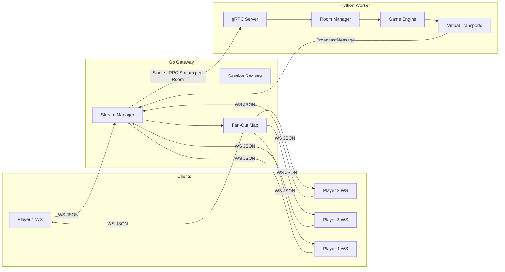
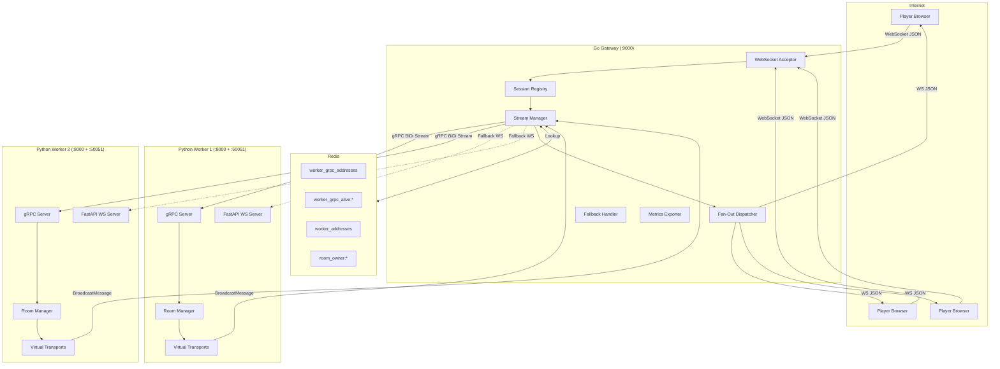
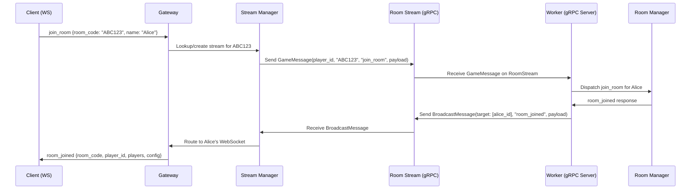
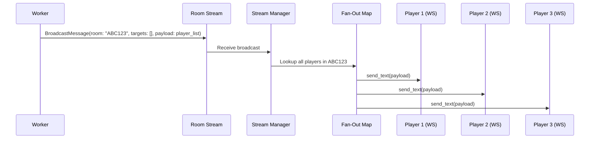
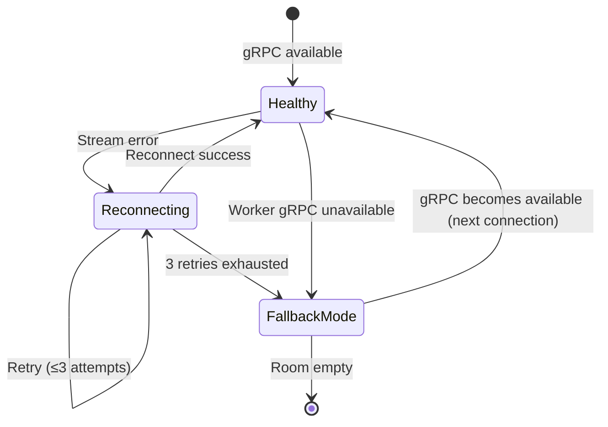

# Design Document: gRPC Multiplexing

## Overview

This feature replaces the per-player WebSocket connection between the Go gateway and Python workers with gRPC bidirectional streaming at the room level. Currently, each player connection results in a dedicated backend WebSocket (5,000 players = 5,000 backend connections). With gRPC multiplexing, the gateway opens **one gRPC stream per room** to the owning worker. Players sharing a room share a single backend connection.

**Key outcomes:**
- Backend connections drop from ~5,000 to ~1,000 (one per room)
- Eliminates the ~500 connections-per-worker Python event loop bottleneck
- Client-facing WebSocket JSON protocol remains unchanged
- Backward-compatible fallback to per-player WebSocket when gRPC is unavailable



### Design Rationale

The current gateway opens a **backend WebSocket per player** and pipes frames bidirectionally. This is simple and transparent but creates O(players) connections per worker, saturating Python's asyncio event loop at ~500 connections. gRPC bidirectional streaming with Protocol Buffers provides:

1. **Connection multiplexing**: One stream carries all messages for a room (typically 2–8 players)
2. **Typed wire format**: protobuf envelopes with explicit player_id routing replace JSON sniffing
3. **Backpressure and flow control**: HTTP/2 flow control per stream prevents one room from starving others
4. **Incremental adoption**: Fallback mode means rolling deployment without downtime

## Architecture

### High-Level Architecture



### Message Flow: Client → Worker (Multiplexed)



### Message Flow: Worker → Clients (Broadcast Fan-Out)



## Components and Interfaces

### 1. Protocol Buffer Definition (`proto/game.proto`)

Defines the wire format for gateway–worker communication.

```protobuf
syntax = "proto3";
package skribbl.gateway.v1;

option go_package = "gateway/proto";

service GameService {
  // Bidirectional stream: one per room.
  // Gateway sends GameMessage (player actions), Worker sends BroadcastMessage (responses/broadcasts).
  rpc RoomStream(stream GameMessage) returns (stream BroadcastMessage);
}

// Envelope for client→worker messages (multiplexed by player_id)
message GameMessage {
  string player_id = 1;
  string room_code = 2;
  string message_type = 3;    // "join_room", "guess", "stroke", etc.
  bytes payload = 4;           // Original JSON payload from client
}

// Envelope for worker→client messages (broadcast or targeted)
message BroadcastMessage {
  string room_code = 1;
  string message_type = 2;    // "player_list", "stroke", "chat_message", etc.
  bytes payload = 3;           // JSON payload to deliver to client(s)
  repeated string target_player_ids = 4;  // Empty = all players in room
}
```

### 2. gRPC Server on Python Workers (`backend/grpc_server.py`)

Runs alongside FastAPI on the same asyncio event loop using `grpc.aio`.

**Interface:**

```python
class GameServiceServicer(game_pb2_grpc.GameServiceServicer):
    """Handles RoomStream RPCs from the gateway."""

    async def RoomStream(
        self,
        request_iterator: AsyncIterator[GameMessage],
        context: grpc.aio.ServicerContext,
    ) -> AsyncIterator[BroadcastMessage]:
        """Process a bidirectional stream for a single room."""
        ...
```

**Key responsibilities:**
- Receive `GameMessage` envelopes, extract player_id/room_code/payload
- Dispatch through existing `room_manager` and `game_engine` logic
- Manage `VirtualTransport` instances per gRPC-connected player
- Serialize writes to the stream using a per-stream `asyncio.Queue`

### 3. Virtual Transport (`backend/virtual_transport.py`)

Adapter that implements `send_text(data)` so existing broadcast logic works without modification.

```python
class VirtualTransport:
    """Routes send_text() calls through the gRPC Room_Stream as BroadcastMessages."""

    def __init__(self, player_id: str, room_code: str, send_queue: asyncio.Queue):
        self.player_id = player_id
        self.room_code = room_code
        self._send_queue = send_queue

    async def send_text(self, data: str) -> None:
        """Enqueue a targeted BroadcastMessage for this player."""
        msg = BroadcastMessage(
            room_code=self.room_code,
            message_type="targeted",
            payload=data.encode("utf-8"),
            target_player_ids=[self.player_id],
        )
        await self._send_queue.put(msg)

    async def send_json(self, data: dict) -> None:
        """Serialize dict to JSON and send via gRPC stream."""
        import json
        await self.send_text(json.dumps(data))
```

### 4. Gateway Stream Manager (`gateway/stream_manager.go`)

Manages the lifecycle of one gRPC stream per room.

```go
// StreamManager manages Room_Stream instances (one per room_code).
type StreamManager struct {
    mu       sync.RWMutex
    streams  map[string]*RoomStream   // room_code -> active stream
    resolver *WorkerResolver
    config   StreamConfig
}

type StreamConfig struct {
    IdleTimeout     time.Duration  // Default: 30s
    KeepaliveInterval time.Duration // Default: 15s
    KeepaliveTimeout  time.Duration // Default: 5s
    MaxRetries      int            // Default: 3
    BufferSize      int            // Default: 500 messages
}

// RoomStream wraps a gRPC bidirectional stream for a room.
type RoomStream struct {
    roomCode   string
    workerID   string
    stream     proto.GameService_RoomStreamClient
    conn       *grpc.ClientConn
    sendCh     chan *proto.GameMessage   // Buffered channel for outbound messages
    playerCount atomic.Int32
    lastActivity atomic.Value            // time.Time
    state      atomic.Int32             // 0=healthy, 1=reconnecting, 2=dead
    buffer     *MessageBuffer           // For buffering during reconnection
}

func (sm *StreamManager) GetOrCreate(roomCode string, workerID string) (*RoomStream, error) { ... }
func (sm *StreamManager) Send(roomCode string, msg *proto.GameMessage) error { ... }
func (sm *StreamManager) Close(roomCode string) { ... }
func (sm *StreamManager) AddPlayer(roomCode string) { ... }
func (sm *StreamManager) RemovePlayer(roomCode string) { ... }
```

### 5. Gateway Session Registry (`gateway/session.go`)

Thread-safe mapping of player sessions for multiplexing/demultiplexing.

```go
// SessionRegistry tracks (player_id, room_code, WS connection) associations.
type SessionRegistry struct {
    mu       sync.RWMutex
    sessions map[string]*PlayerSession  // player_id -> session
    byRoom   map[string]map[string]*PlayerSession // room_code -> {player_id -> session}
}

type PlayerSession struct {
    PlayerID  string
    RoomCode  string
    Conn      *websocket.Conn
    SendCh    chan []byte   // Non-blocking outbound queue
}

func (sr *SessionRegistry) Register(playerID, roomCode string, conn *websocket.Conn) { ... }
func (sr *SessionRegistry) Unregister(playerID string) { ... }
func (sr *SessionRegistry) Update(playerID string, conn *websocket.Conn) { ... }
func (sr *SessionRegistry) GetByRoom(roomCode string) []*PlayerSession { ... }
func (sr *SessionRegistry) GetByPlayer(playerID string) *PlayerSession { ... }
```

### 6. Fan-Out Dispatcher (`gateway/fanout.go`)

Delivers broadcast messages from the worker to relevant client WebSockets.

```go
// FanOutDispatcher receives BroadcastMessages from Room_Streams
// and delivers payloads to the correct client WebSocket connections.
type FanOutDispatcher struct {
    registry *SessionRegistry
}

func (f *FanOutDispatcher) Deliver(msg *proto.BroadcastMessage) {
    if len(msg.TargetPlayerIds) == 0 {
        // Broadcast to all players in room
        sessions := f.registry.GetByRoom(msg.RoomCode)
        for _, s := range sessions {
            s.SendCh <- msg.Payload  // Non-blocking enqueue
        }
    } else {
        // Targeted delivery
        for _, pid := range msg.TargetPlayerIds {
            if s := f.registry.GetByPlayer(pid); s != nil {
                s.SendCh <- msg.Payload
            }
        }
    }
}
```

### 7. Fallback Handler

Maintains backward-compatible per-player WebSocket proxying when gRPC is unavailable.

```go
func (gw *Gateway) handleWithFallback(clientConn *websocket.Conn, firstMsg []byte, roomCode, workerID string) {
    // Attempt gRPC path
    if gw.isGRPCAvailable(workerID) {
        gw.handleGRPC(clientConn, firstMsg, roomCode, workerID)
        return
    }
    // Fall back to existing per-player WS proxy
    gw.handleWebSocketProxy(clientConn, firstMsg)
}
```

### 8. Observability Layer

```go
// Prometheus metrics exposed on /metrics
var (
    grpcStreamsActive = prometheus.NewGauge(prometheus.GaugeOpts{
        Name: "grpc_streams_active",
        Help: "Number of currently open Room_Streams",
    })
    grpcStreamErrorsTotal = prometheus.NewCounterVec(prometheus.CounterOpts{
        Name: "grpc_stream_errors_total",
        Help: "Stream failures by error type",
    }, []string{"error_type"})
    grpcMessagesPerStream = prometheus.NewHistogram(prometheus.HistogramOpts{
        Name:    "grpc_messages_per_stream",
        Help:    "Messages multiplexed per stream per minute",
        Buckets: prometheus.ExponentialBuckets(1, 2, 12),
    })
    grpcFallbackActivationsTotal = prometheus.NewCounter(prometheus.CounterOpts{
        Name: "grpc_fallback_activations_total",
        Help: "Number of times Fallback_Mode was activated",
    })
)
```

## Data Models

### Proto Messages (Wire Format)

| Field | Type | Description |
|-------|------|-------------|
| `GameMessage.player_id` | string | UUID of the sending player |
| `GameMessage.room_code` | string | 6-char room code |
| `GameMessage.message_type` | string | Action type (e.g., "guess", "stroke") |
| `GameMessage.payload` | bytes | Original JSON payload from client |
| `BroadcastMessage.room_code` | string | Target room |
| `BroadcastMessage.message_type` | string | Response type |
| `BroadcastMessage.payload` | bytes | JSON payload for clients |
| `BroadcastMessage.target_player_ids` | repeated string | Empty = broadcast to all |

### Gateway In-Memory State

```go
// Stream Manager state
type streamManagerState struct {
    streams map[string]*RoomStream  // room_code -> stream (O(1) lookup)
}

// Session Registry state
type sessionRegistryState struct {
    sessions map[string]*PlayerSession           // player_id -> session (O(1))
    byRoom   map[string]map[string]*PlayerSession // room_code -> {player_id -> session} (O(1) room lookup, O(n) fan-out)
}

// Message Buffer (per-stream, used during reconnection)
type MessageBuffer struct {
    mu       sync.Mutex
    messages []*proto.GameMessage
    maxSize  int  // 500
    dropped  int  // Count of dropped messages
}
```

### Redis Keys (Service Discovery)

| Key | Type | Value | TTL |
|-----|------|-------|-----|
| `worker_grpc_addresses` | Hash | `{worker_id: "hostname:50051"}` | — |
| `worker_grpc_alive:{worker_id}` | String | `"1"` | 30s |
| `worker_addresses` | Hash | `{worker_id: "hostname:8000"}` | — |
| `worker_alive:{worker_id}` | String | `"1"` | 30s |
| `room_owner:{room_code}` | String | worker_id | 3600s |

### Python Worker State Additions

```python
@dataclass
class GRPCPlayerState:
    """Per-player state for gRPC-connected players."""
    player_id: str
    room_code: str
    virtual_transport: VirtualTransport  # Implements send_text()
    connected_at: float                   # epoch seconds

@dataclass  
class RoomStreamState:
    """Per-room gRPC stream state on the worker side."""
    room_code: str
    send_queue: asyncio.Queue            # Outbound BroadcastMessages
    players: dict[str, GRPCPlayerState]  # player_id -> state
    stream_context: grpc.aio.ServicerContext
    created_at: float
```


## Correctness Properties

*A property is a characteristic or behavior that should hold true across all valid executions of a system — essentially, a formal statement about what the system should do. Properties serve as the bridge between human-readable specifications and machine-verifiable correctness guarantees.*

### Property 1: Proto Serialization Round-Trip

*For any* valid `GameMessage` (with arbitrary player_id, room_code, message_type, and payload bytes) and *for any* valid `BroadcastMessage` (with arbitrary room_code, message_type, payload bytes, and any number of target_player_ids), serializing to protobuf wire format and then deserializing back SHALL produce a message with all fields identical to the original.

**Validates: Requirements 1.2, 1.3**

### Property 2: Message Dispatch Correctness

*For any* valid `GameMessage` received on a `RoomStream` with a known `message_type` (from the set: create_room, join_room, reconnect, guess, stroke, fill, clear_canvas, chat, kick_player, leave_room, reaction, toggle_ready, start_game, select_word, update_settings, rematch, end_game_now), the gRPC server SHALL dispatch the message to the same handler that would have been invoked by the WebSocket handler for the same message_type.

**Validates: Requirements 2.2**

### Property 3: VirtualTransport Produces Correct BroadcastMessage

*For any* player_id, room_code, and arbitrary string data, calling `VirtualTransport.send_text(data)` SHALL produce a `BroadcastMessage` where `room_code` matches the transport's room, `payload` equals the data encoded as UTF-8, and `target_player_ids` contains exactly the transport's player_id.

**Validates: Requirements 2.3, 2.5**

### Property 4: Broadcast Routes to Correct Transport Type

*For any* room containing a mix of WebSocket-connected players and gRPC-connected players (with virtual transports), calling `broadcast(room_code, message)` SHALL deliver the message to WebSocket players via `websocket.send_text()` and to gRPC players via their `VirtualTransport.send_text()`, with no player receiving duplicate messages and no player being missed.

**Validates: Requirements 2.4**

### Property 5: Stream Reuse Per Room (Multiplexing Invariant)

*For any* sequence of N players (N ≥ 1) joining the same room_code through the Stream Manager, the number of active Room_Streams for that room_code SHALL remain exactly 1 throughout the sequence.

**Validates: Requirements 3.2, 9.4**

### Property 6: Per-Player Message Ordering

*For any* sequence of messages [m₁, m₂, ..., mₙ] sent by a single player through the gateway over a Room_Stream, the messages SHALL arrive at the worker in the same order [m₁, m₂, ..., mₙ].

**Validates: Requirements 4.4**

### Property 7: Fan-Out Delivery Targets

*For any* `BroadcastMessage` received by the gateway: if `target_player_ids` is empty, all players registered in the fan-out map for that room SHALL receive the payload; if `target_player_ids` is non-empty, exactly those players (and no others) SHALL receive the payload.

**Validates: Requirements 5.1, 5.2**

### Property 8: Fallback Mode Decision

*For any* worker_id, if the Redis key `worker_grpc_alive:{worker_id}` does not exist OR the `worker_grpc_addresses` hash has no entry for that worker_id, the gateway SHALL use WebSocket fallback mode for connections to that worker (never attempt gRPC).

**Validates: Requirements 6.1, 8.5**

### Property 9: Session Registry Correctness

*For any* sequence of successful `create_room`, `join_room`, or `reconnect` responses containing a player_id and room_code, the session registry SHALL contain an entry mapping that player_id to the correct room_code and WebSocket connection. After a `reconnect`, the stored WebSocket connection SHALL be the new connection (not the old one).

**Validates: Requirements 7.1, 7.2**

### Property 10: Unidentified Client Rejection

*For any* message sent by a client WebSocket that has not completed a successful create_room, join_room, or reconnect handshake, the gateway SHALL respond with an error containing code "NOT_IDENTIFIED" and SHALL NOT forward the message to any worker.

**Validates: Requirements 7.5**

### Property 11: Concurrent Session Registry Safety

*For any* set of concurrent Register, Unregister, Update, and Lookup operations on the session registry executed from multiple goroutines, the registry SHALL never produce data races (verifiable with Go's race detector), and a Lookup after a Register SHALL always return the registered session.

**Validates: Requirements 7.6**

### Property 12: Message Buffer FIFO with Overflow

*For any* sequence of N messages buffered during a stream reconnection: if N ≤ 500, all N messages SHALL be replayed in insertion order upon reconnection; if N > 500, the newest 500 messages SHALL be retained (oldest N−500 dropped), and replay SHALL preserve insertion order of the retained messages.

**Validates: Requirements 10.2, 10.3, 10.4**

## Error Handling

### Gateway Error Scenarios

| Error | Detection | Response | Recovery |
|-------|-----------|----------|----------|
| Worker gRPC unreachable | `grpc.Dial` timeout (5s) | Activate Fallback_Mode for room | Log warning, increment `grpc_fallback_activations_total` |
| Room_Stream transport error | gRPC `Status.UNAVAILABLE` or EOF | Buffer messages, begin reconnection | 3 retries with exponential backoff (1s, 2s, 4s) |
| Reconnection exhausted (3 failures) | All retries failed | Enter Fallback_Mode | Migrate all players in room to WS proxy |
| Buffer overflow | `len(buffer) > 500` | Drop oldest messages | Log warning with room_code and drop count |
| Worker not in `worker_grpc_addresses` | Redis HGET returns nil | Use WebSocket fallback | Check again on next connection attempt |
| `worker_grpc_alive` key missing | Redis EXISTS returns 0 | Skip gRPC, use WS fallback | Resolver cache evicts stale entry |
| Client not identified | No player_id in session registry | Return `NOT_IDENTIFIED` error | Close connection if repeated |
| Room_Stream keepalive timeout | No pong within 5s of ping | Mark stream dead | Trigger reconnection flow |
| Invalid protobuf on stream | `proto.Unmarshal` error | Log, skip message | Stream remains open for valid messages |

### Worker Error Scenarios

| Error | Detection | Response | Recovery |
|-------|-----------|----------|----------|
| gRPC port bind failure | `grpc.aio.server.start()` raises | Log error, skip gRPC startup | Continue in WebSocket-only mode |
| Stream context cancelled | `context.cancelled()` | Clean up player virtual transports | Players marked disconnected (grace window) |
| VirtualTransport queue full | `asyncio.Queue` full (backpressure) | Apply backpressure to stream reads | Slow down ingestion from gateway |
| Invalid JSON in payload | `json.loads()` raises | Send error BroadcastMessage back | Stream remains open |
| Game engine exception | Exception in handler dispatch | Send error to specific player | Room state unchanged |

### Fallback Mode Transitions



## Testing Strategy

### Property-Based Tests (Hypothesis — Python)

Property-based testing is appropriate for this feature because the core logic involves data transformations (protobuf serialization), routing decisions (fan-out, fallback), and data structure invariants (buffer, session registry) — all of which have clear universal properties across input spaces.

**Library:** Hypothesis (Python, already in use) + `rapid` (Go, for gateway-side tests)

**Configuration:** Minimum 100 iterations per property test.

**Tag format:** `Feature: grpc-multiplexing, Property {N}: {text}`

| Property | Test File | Strategy |
|----------|-----------|----------|
| 1: Proto round-trip | `backend/tests/test_property_grpc_proto.py` | Generate random GameMessage/BroadcastMessage, serialize → deserialize, assert equality |
| 2: Dispatch correctness | `backend/tests/test_property_grpc_dispatch.py` | Generate message_types from known set + random payloads, verify handler routing |
| 3: VirtualTransport output | `backend/tests/test_property_grpc_transport.py` | Generate random (player_id, room_code, data), assert BroadcastMessage fields |
| 4: Broadcast routing | `backend/tests/test_property_grpc_broadcast.py` | Generate rooms with mixed transport types, assert correct delivery |
| 5: Stream reuse | `gateway/stream_manager_test.go` | Generate N join sequences, assert stream count = 1 |
| 6: Per-player ordering | `gateway/stream_manager_test.go` | Generate ordered message sequences, verify arrival order |
| 7: Fan-out targets | `gateway/fanout_test.go` | Generate target lists, verify delivery set |
| 8: Fallback decision | `gateway/fallback_test.go` | Generate worker states (±gRPC alive), verify mode |
| 9: Session registry | `gateway/session_test.go` | Generate register/reconnect sequences, verify state |
| 10: Unidentified rejection | `gateway/session_test.go` | Generate messages without prior handshake, verify error |
| 11: Concurrent safety | `gateway/session_test.go` | Concurrent operations with `-race`, verify no races |
| 12: Buffer FIFO | `gateway/buffer_test.go` | Generate sequences of 0–1000 messages, verify retention/order |

### Unit Tests (Example-Based)

| Component | Test Cases |
|-----------|------------|
| Proto compilation | Verify `make proto-gen` succeeds, imports work in both languages |
| VirtualTransport | Specific examples: empty data, Unicode data, large payload |
| Stream Manager | First player opens stream, last player triggers idle timeout |
| Fallback Handler | gRPC unavailable → WS proxy path exercised |
| Metrics | Each metric increments correctly on specific events |
| Health endpoint | `grpc_enabled` field present and accurate |

### Integration Tests

| Scenario | Description |
|----------|-------------|
| End-to-end room lifecycle | create_room → join_room → play → game_over via gRPC path |
| Reconnection mid-game | Player reconnects, receives buffered state |
| Fallback activation | Kill gRPC port, verify WS proxy takes over seamlessly |
| Worker registration | Start worker, verify Redis entries, shutdown, verify cleanup |
| Load test (10K users) | k6 script with 10K VUs, measure latency and stream counts |
| Keepalive timeout | Delay pong, verify stream marked dead and reconnection triggered |

### Performance Tests

| Test | Target | Tool |
|------|--------|------|
| 10K concurrent connections | 100% connection success | k6 + custom gateway script |
| p95 latency | < 50ms end-to-end | k6 with latency measurement |
| Stream count under load | < 1,500 total streams | Prometheus query during load test |
| Per-worker streams | < 200 per worker | Prometheus query |
| Game completion rate | > 80% at 10K users | k6 scenario with full game flow |
