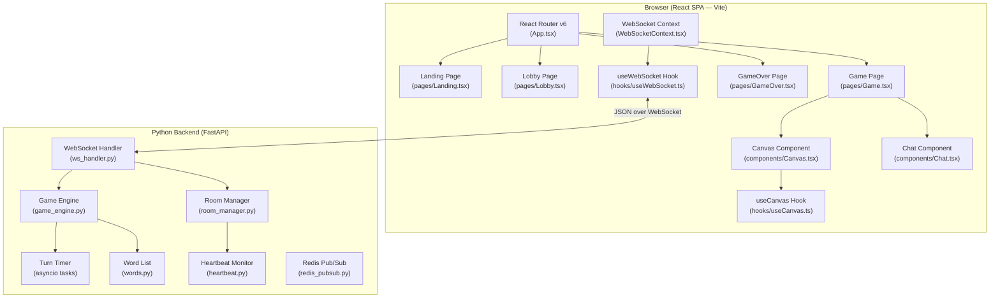

# Design Document: Pictionary Game

## Overview

This document describes the technical design for a real-time multiplayer drawing and guessing game (Pictionary / skribbl.io-style). The system is composed of two main parts:

- **Backend**: A Python server built with FastAPI and its native WebSocket support, responsible for room lifecycle, game state, turn/round management, scoring, and real-time message broadcasting.
- **Frontend**: A browser-based single-page application (SPA) built with **React 18** (via **Vite**), using **React Router v6** for client-side navigation between views, a **WebSocket context** for shared real-time state, and a **`useCanvas` hook** wrapping the HTML5 canvas element for drawing.

Communication between client and server is exclusively over WebSocket connections, with all messages serialized as JSON. The server is stateful in-process (no external database required for a single-server deployment), holding all room and game state in memory. For multi-worker deployments, Redis pub/sub synchronizes broadcasts across workers, and sticky session cookies ensure players reconnect to the same worker.

### Key Design Goals

- **Low latency**: Stroke data must reach all clients within 100 ms of receipt by the server.
- **Correctness**: Game rules (scoring, hint progression, turn advancement) are enforced exclusively on the server; the client is a thin rendering layer.
- **Resilience**: Disconnections are handled gracefully without crashing the game for remaining players.
- **Simplicity**: The frontend is a standard Vite + React project; the backend remains a plain FastAPI process with no awareness of the frontend build toolchain.

---

## Architecture



### Deployment Topology

A single Python process serves both the WebSocket API and the static frontend files. For development, `uvicorn` runs the FastAPI app. The frontend is served as static files from a `/static` directory.

```
skribbl-app/
├── backend/
│   ├── main.py              # FastAPI app, mounts static files, registers WS route, sticky session middleware
│   ├── ws_handler.py        # WebSocket connection lifecycle
│   ├── room_manager.py      # Room CRUD, player management, kick/leave/ready
│   ├── game_engine.py       # Turn/round logic, scoring, hint progression
│   ├── models.py            # Dataclasses / Pydantic models
│   ├── words.py             # Default word list (200+ words)
│   ├── heartbeat.py         # Ping/pong monitoring
│   └── redis_pubsub.py      # Redis adapter (pub/sub, room registry, worker ID)
└── frontend/                # Vite + React 18 project
    ├── index.html           # Vite HTML entry point (single root <div id="root">)
    ├── vite.config.ts       # Vite configuration (proxy /ws → backend in dev)
    ├── tsconfig.json        # TypeScript configuration (strict mode)
    ├── tsconfig.node.json   # TypeScript config for Vite config file
    ├── package.json
    └── src/
        ├── main.tsx         # React DOM root — ReactDOM.createRoot + <App />
        ├── App.tsx          # React Router v6 <Routes> definitions
        ├── pages/
        │   ├── Landing.tsx  # Create / join room form
        │   ├── Lobby.tsx    # Waiting room, settings, player list, ready check
        │   ├── Game.tsx     # Active game view (canvas + chat + word selection)
        │   └── GameOver.tsx # Final leaderboard, rematch button
        ├── components/
        │   ├── Canvas.tsx   # HTML5 <canvas> element + drawing toolbar
        │   ├── Chat.tsx     # Chat feed + guess input + emoji reactions
        │   ├── PlayerList.tsx     # Shared player list with scores and status
        │   ├── TimerBar.tsx       # Countdown progress bar
        │   └── RoundTransition.tsx # Animated round transition overlay
        ├── hooks/
        │   ├── useCanvas.ts    # Canvas drawing logic, tool/color/size state
        │   └── useWebSocket.ts # WebSocket connection lifecycle, send helper
        ├── context/
        │   └── WebSocketContext.tsx  # Context provider: WS instance + gameReducer + auto-reconnect
        └── types/
            └── index.ts     # Shared TypeScript interfaces (PlayerInfo, GameConfig, GameState, etc.)
```

---

## Components and Interfaces

### Backend Components

#### `ws_handler.py` — WebSocket Lifecycle

Manages the raw WebSocket connection for each client. On connect, it waits for an `identify` message (player name + optional room code). On disconnect (clean or unexpected), it delegates to `RoomManager` for cleanup.

```python
@app.websocket("/ws")
async def websocket_endpoint(websocket: WebSocket):
    await websocket.accept()
    player_id = str(uuid4())
    try:
        async for raw in websocket.iter_text():
            msg = json.loads(raw)
            await dispatch(player_id, websocket, msg)
    except WebSocketDisconnect:
        await room_manager.handle_disconnect(player_id)
```

#### `room_manager.py` — Room CRUD and Player Management

Owns the in-memory registry of all active `Room` objects. Uses a `_player_to_room: dict[str, str]` index for O(1) player-to-room lookups (eliminates linear scans across all rooms). Responsible for:
- Generating unique `Room_Code` values (6-character alphanumeric, uppercase)
- Adding/removing players (with `Room.add_player` / `Room.remove_player` maintaining `players_by_id` index)
- Host reassignment on host disconnect
- Broadcasting player-list updates
- **Kick/leave/ready**: Host can kick players, any player can leave voluntarily, players can toggle ready status in lobby
- **Settings validation**: Validates and applies settings updates with range enforcement
- **Disconnection handling**: On disconnect, marks the player as disconnected (`is_connected = False`, sets `disconnect_time`) and schedules a 120-second `cleanup_task` (`asyncio.Task`) that permanently removes the player if they do not reconnect. When fewer than 2 players remain, starts a 20-second countdown with `waiting_for_reconnect` broadcast; host can `end_game_now` to skip the countdown.
- **Reconnection handling**: On reconnect (matching `room_code` + `name` within 120 seconds), cancels the `cleanup_task`, restores the player's WebSocket reference, resets `is_connected = True` and clears `disconnect_time`, then broadcasts `player_reconnected`
- **Redis integration**: When Redis is configured, publishes broadcasts to Redis channels for cross-worker relay and handles incoming Redis messages to deliver to local players

#### `game_engine.py` — Game Logic

Owns the state machine for each room's game. Responsible for:
- Starting a game (transition Lobby → Playing)
- Managing turn lifecycle (word selection, hint scheduling, timer)
- Evaluating guesses
- Computing scores
- Advancing turns and rounds
- Transitioning to Game Over
- **Skipping disconnected players**: When advancing to the next drawer, skips any player with `is_connected = False`
- **Zero-point enforcement for disconnected players**: Disconnected players receive 0 points for any turns/rounds that occur while they are disconnected (they cannot guess, so no score is awarded)

Turn timers are implemented as `asyncio.Task` objects, one per active turn. Hint reveals at 40% and 70% are scheduled as `asyncio.sleep` calls within the same task.

#### `heartbeat.py` — Connection Health

A background `asyncio.Task` per connection sends a WebSocket ping every 30 seconds. If no pong is received within 10 seconds, the connection is forcibly closed and treated as a disconnect.

#### `words.py` — Word List

A plain Python list of 200+ common nouns/objects. Loaded once at startup. The `GameEngine` maintains a per-game shuffled copy and tracks used words.

### Frontend Components

#### `context/WebSocketContext.tsx` — Shared WebSocket State

A React Context provider that wraps the WebSocket connection and exposes shared game state to the entire component tree via the Context API. Provides:
- `send(type, payload)` — serializes and dispatches a JSON message over the WebSocket
- `gameState` — the current `GameState` object derived from `useReducer` (see Client-Side State below)
- `dispatch` — the `useReducer` dispatcher; incoming server messages are routed through this to drive state transitions
- **Snake-to-camelCase mapping**: All incoming server payloads are recursively converted from `snake_case` keys to `camelCase` before dispatching to the reducer (e.g., `room_code` → `roomCode`, `player_id` → `playerId`)
- **Drawing event handling**: `stroke`, `fill`, and `clear_canvas` messages are dispatched as `DRAWING_EVENT` actions with a unique ID to ensure every event triggers a re-render
- **Reaction handling**: `reaction` messages are converted to system chat messages for display
- **Auto-reconnect on page refresh**: Stores session info (player name, room code) in `sessionStorage`; on WebSocket open, checks the current route and sends a `reconnect` message to restore the session
- The provider is mounted at the root in `main.tsx`, wrapping `<App />`, so all pages and components can consume it with `useContext(WebSocketContext)`

#### `hooks/useWebSocket.ts` — WebSocket Hook

A custom hook consumed by components that need to send messages or read connection status. Internally calls `useContext(WebSocketContext)` and returns `{ send, isConnected, gameState }`. Components never interact with the raw `WebSocket` object directly, keeping the connection lifecycle encapsulated in the context provider.

#### `hooks/useCanvas.ts` — Canvas Drawing Hook

A custom hook that accepts a `React.RefObject<HTMLCanvasElement>` and an `isDrawer` boolean. Encapsulates all drawing logic:
- Pointer event listeners attached via `useEffect` (mousedown/mousemove/mouseup + touch equivalents)
- **Real-time stroke streaming**: Each mousemove sends a 2-point segment immediately to the server (not batched on mouseup), enabling other players to see drawing in real-time
- **Coordinate scaling**: Accounts for CSS responsive scaling by computing `scaleX = canvas.width / rect.width` to map pointer coordinates to internal canvas resolution
- Stroke rendering for locally drawn and remotely received strokes
- Flood-fill (BFS on pixel data via `getImageData`/`putImageData`)
- Eraser (stroke with canvas background color)
- Clear canvas
- Tool, color, and brush-size state managed with `useState`
- All pointer event handlers are no-ops when `isDrawer` is `false`
- Returns `{ color, setColor, brushSize, setBrushSize, tool, setTool, clearCanvas, renderRemoteStroke, renderRemoteFill }`

#### `pages/Landing.tsx` — Landing Page

A functional component rendered at route `/`. Manages local form state (`useState`) for player name and room code. On submit, calls `send('create_room', ...)` or `send('join_room', ...)` via `useWebSocket`. On receiving `room_created` / `room_joined` (via `gameState.phase` transitioning to `'lobby'`), uses React Router's `useNavigate` to push `/lobby/:roomCode`.

#### `pages/Lobby.tsx` — Lobby Page

A functional component rendered at route `/lobby/:roomCode`. Reads `players`, `config`, and `isHost` from `useWebSocket`. Renders `<PlayerList />` and, for the host, a settings form whose `onChange` handlers call `send('update_settings', ...)`. The Start Game button calls `send('start_game')`. Navigates to `/game/:roomCode` when `gameState.phase` becomes `'playing'`.

#### `pages/Game.tsx` — Game Page

The main game view rendered at route `/game/:roomCode`. Handles two phases:
- **Word selection phase**: Shows word choice buttons to the drawer (who picks one), while guessers see "{drawer's name} is choosing a word..." message. If the drawer doesn't select within 15 seconds, the server auto-assigns a word and sends `word_assigned`.
- **Playing phase**: Composes `<Canvas />` and `<Chat />` side by side. The drawer sees the actual word displayed instead of underscores. Uses a `useEffect`-driven `setInterval` to decrement a local timer counter and dispatch `TICK` actions to the reducer. Renders the hint display (underscores for guessers, full word for drawer), round/turn indicators, `<PlayerList />` with live scores, and `<RoundTransition />` for animated round transitions. Calls `useNavigate` to push `/gameover/:roomCode` when `gameState.phase` becomes `'game_over'`.
- **Reconnect waiting phase**: Displays a countdown when `waitingForReconnect` is true, with an "End Now" button for the host.

#### `pages/GameOver.tsx` — Game Over Page

A functional component rendered at route `/gameover/:roomCode`. Reads final `players` (sorted by score) from `useWebSocket` and renders the ranked leaderboard. Shows a Rematch button that calls `send('rematch')`; the button is disabled when `isHost` is `false`.

#### `components/Canvas.tsx` — Canvas Component

Renders a `<canvas>` element (via a `useRef`) and the drawing toolbar. Passes the ref and `isDrawer` to `useCanvas` and spreads the returned state into the toolbar controls (color picker, brush size selector, tool toggle buttons, clear button). Toolbar controls are hidden when `isDrawer` is `false`. Incoming `stroke`, `fill`, and `clear_canvas` server messages (received via `gameState`) are forwarded to `renderRemoteStroke` / `renderRemoteFill` / `clearCanvas` from the hook.

#### `components/Chat.tsx` — Chat Component

Renders a scrollable message feed (`<ul>` auto-scrolled via `useRef` + `useEffect`) and a controlled `<input>` for the guess/chat field. Submitting the form calls `send('guess', { text })` when the local player is a Guesser, or `send('chat', { text })` when the Drawer. The Drawer can chat freely — the backend strips the actual word from their messages before broadcasting (replacing with `***`). The input is disabled only when `hasGuessed` is `true` (guesser already guessed). System messages and correct-guess notifications receive distinct CSS classes for styling.

#### `components/PlayerList.tsx` — Player List Component

A pure presentational component that accepts a `players: PlayerInfo[]` prop and renders each player's name, score, and connection/guessed status. Used in both `Lobby.tsx` and `Game.tsx`.

#### `components/TimerBar.tsx` — Timer Bar Component

A presentational component that accepts `seconds: number` and `total: number` props and renders a CSS-animated progress bar. Consumed by `Game.tsx`.

#### `components/RoundTransition.tsx` — Round Transition Overlay

A presentational component that renders a full-screen overlay animation when a new round starts. It slides in from the bottom, pauses to display "Round N / M", and then slides out upward. Accepts `round`, `totalRounds`, `show`, and `onComplete` props. The animation runs for ~1.3 seconds total (400ms enter + 500ms pause + 400ms exit).

---

## Data Models

### Server-Side (Python dataclasses)

```python
from dataclasses import dataclass, field
from enum import Enum
from typing import Optional
import asyncio

class RoomState(Enum):
    LOBBY = "lobby"
    WORD_SELECTION = "word_selection"
    PLAYING = "playing"
    GAME_OVER = "game_over"

class TurnEndReason(Enum):
    TIMER_EXPIRED = "timer_expired"
    ALL_GUESSED = "all_guessed"
    DRAWER_DISCONNECTED = "drawer_disconnected"

@dataclass
class Player:
    id: str                        # UUID, server-assigned
    name: str                      # Display name (1–20 chars)
    score: int = 0
    has_guessed: bool = False      # True once correct guess in current turn
    is_connected: bool = True
    is_ready: bool = False         # Ready status in lobby
    websocket: object = None       # WebSocket instance (not serialized)
    disconnect_time: Optional[float] = None  # epoch seconds; set when player disconnects, used to track the 120-second reconnection grace window
    cleanup_task: Optional[asyncio.Task] = None  # asyncio task that fires after 120s to permanently remove the player if not reconnected

@dataclass
class GameConfig:
    num_rounds: int = 3            # 2–10
    turn_duration: int = 80        # 30–180 seconds
    max_players: int = 8           # 2–12

@dataclass
class TurnState:
    drawer_id: str
    word: str
    hint: list[str]                # list of chars; '_' for hidden
    start_time: float              # epoch seconds
    word_choices: list[str]        # 3 options shown to drawer
    timer_task: Optional[asyncio.Task] = None
    hint_task_40: Optional[asyncio.Task] = None
    hint_task_70: Optional[asyncio.Task] = None
    guess_order: list[str] = field(default_factory=list)  # player IDs in order they guessed (eliminates sorting at turn end)

@dataclass
class Room:
    code: str                      # 6-char alphanumeric
    host_id: str
    players: list[Player] = field(default_factory=list)       # ordered list for drawer rotation
    players_by_id: dict = field(default_factory=dict)         # player_id → Player for O(1) lookup
    config: GameConfig = field(default_factory=GameConfig)
    state: RoomState = RoomState.LOBBY
    current_round: int = 0
    drawer_index: int = 0          # index into players list
    turn: Optional[TurnState] = None
    used_words: set[str] = field(default_factory=set)
    word_pool: deque = field(default_factory=deque)           # deque for efficient word pool management
```

### WebSocket Message Protocol

All messages are JSON objects with a `type` field and an optional `payload` field.

#### Client → Server Messages

| `type` | Payload fields | Description |
|---|---|---|
| `create_room` | `name` | Create a new room; player becomes Host |
| `join_room` | `name`, `room_code` | Join an existing room |
| `reconnect` | `name`, `room_code` | Reconnect to a room after page refresh (within 120s grace window) |
| `update_settings` | `num_rounds?`, `turn_duration?`, `max_players?` | Host updates config |
| `start_game` | — | Host starts the game |
| `select_word` | `word` | Drawer selects a word from the 3 choices |
| `stroke` | `points`, `color`, `size` | Drawer sends a stroke segment |
| `fill` | `x`, `y`, `color` | Drawer sends a fill operation |
| `clear_canvas` | — | Drawer clears the canvas |
| `guess` | `text` | Guesser submits a guess |
| `chat` | `text` | Player sends a chat message (lobby chat or drawer in-game chat) |
| `reaction` | `emoji` | Player sends an emoji reaction |
| `toggle_ready` | — | Player toggles ready state in lobby |
| `kick_player` | `target_player_id` | Host kicks a player |
| `leave_room` | — | Player leaves the room voluntarily |
| `rematch` | — | Host requests a rematch |
| `end_game_now` | — | Host ends game immediately during disconnect countdown |
| `pong` | — | Application-level heartbeat response |

#### Server → Client Messages

| `type` | Payload fields | Description |
|---|---|---|
| `room_created` | `room_code`, `player_id`, `config` | Confirms room creation |
| `room_joined` | `room_code`, `player_id`, `players`, `config`, `is_host` | Confirms join; full state |
| `reconnected` | `room_code`, `player_id`, `players`, `config`, `state`, `host_id`, `drawer_id`, `hint`, `current_round` | Full state restore on reconnection |
| `error` | `code`, `message` | Error response |
| `player_list` | `players` | Updated player list broadcast |
| `settings_updated` | `config` | Config change broadcast |
| `game_started` | `drawer_id`, `round`, `total_rounds`, `config` | Game begins |
| `word_choices` | `choices` | Sent only to Drawer (3 words) |
| `drawer_selecting` | `drawer_id`, `drawer_name` | Broadcast: drawer is choosing a word |
| `word_assigned` | `word` | Sent to drawer on auto-select (15s timeout) |
| `turn_started` | `drawer_id`, `hint`, `duration`, `round` | Turn begins; hint = underscores |
| `hint_update` | `hint` | Partial reveal broadcast to Guessers |
| `stroke` | `points`, `color`, `size` | Stroke broadcast to all non-Drawer clients |
| `fill` | `x`, `y`, `color` | Fill broadcast |
| `clear_canvas` | — | Clear broadcast |
| `guess_correct` | `player_name`, `player_id`, `score` | A guesser guessed correctly (word not revealed) |
| `chat_message` | `player_name`, `text`, `is_system` | Chat message broadcast |
| `turn_ended` | `word`, `scores`, `reason` | Turn over; word revealed, score deltas |
| `game_over` | `scores` | Final ranked scores |
| `player_reconnected` | `player_id`, `name` | Reconnected player restored |
| `waiting_for_reconnect` | `seconds` | Countdown before ending game on disconnect |
| `reconnect_resumed` | — | Player reconnected, countdown cancelled |
| `game_ended_insufficient_players` | `players` | Game ended due to too few players |
| `rematch_started` | `players`, `config` | New game starting, all scores reset |
| `kicked` | `message` | Sent to kicked player |
| `left_room` | — | Confirmation that player left |
| `reaction` | `player_name`, `emoji` | Emoji reaction broadcast |

### Client-Side State (React)

State is managed at two levels:

- **Global game state** shared across all pages lives in `WebSocketContext` via `useReducer`. The reducer handles all incoming server messages and produces a new `GameState` immutably.
- **Local UI state** (input field values, tool selection, timer countdown) lives in individual components via `useState`.

```typescript
// types/index.ts — shared interfaces
export interface PlayerInfo {
  id: string;
  name: string;
  score: number;
  isHost: boolean;
  hasGuessed: boolean;
  isConnected: boolean;
  isReady: boolean;
}

export interface GameConfig {
  numRounds: number;
  turnDuration: number;
  maxPlayers: number;
}

export type GamePhase = 'idle' | 'lobby' | 'word_selection' | 'playing' | 'game_over';

export interface GameState {
  phase: GamePhase;
  roomCode: string | null;
  localPlayerId: string | null;   // assigned by server on join/create
  isHost: boolean;
  isDrawer: boolean;
  players: PlayerInfo[];
  config: GameConfig;
  hint: string[];                  // array of chars ('_' or revealed letter)
  wordChoices: string[];           // word choices for drawer during word_selection phase
  drawingEvent: { type: string; payload: unknown; id: number } | null;  // latest remote drawing event
  currentWord: string | null;      // the selected word (only set for the drawer)
  drawerId: string | null;         // current drawer's player ID
  currentRound: number;
  totalRounds: number;
  timerSeconds: number;
  hasGuessed: boolean;
  errorMessage: string | null;
  chatMessages: ChatMessage[];
  waitingForReconnect: boolean;    // true during 20s countdown
  reconnectCountdown: number;      // seconds remaining in reconnect countdown
}

export interface ChatMessage {
  id: string;
  senderId: string;
  senderName: string;
  text: string;
  type: 'chat' | 'correct_guess' | 'system';
}
```

```typescript
// context/WebSocketContext.tsx — reducer, context, and provider

// Action union type — one action per server message type that mutates state
type Action =
  | { type: 'ROOM_CREATED'; payload: { roomCode: string; playerId: string; config?: GameConfig } }
  | { type: 'ROOM_JOINED'; payload: { roomCode: string; playerId: string; isHost: boolean } }
  | { type: 'PLAYER_LIST'; payload: { players: PlayerInfo[] } }
  | { type: 'SETTINGS_UPDATED'; payload: { config: GameConfig } }
  | { type: 'GAME_STARTED'; payload: { config?: GameConfig; totalRounds?: number; round?: number; drawerId?: string } }
  | { type: 'WORD_CHOICES'; payload: { choices: string[] } }
  | { type: 'TURN_STARTED'; payload: { drawerId: string; hint: string[]; duration: number; round: number } }
  | { type: 'HINT_UPDATE'; payload: { hint: string[] } }
  | { type: 'GUESS_CORRECT'; payload: { playerId: string; playerName: string; score: number } }
  | { type: 'CHAT_MESSAGE'; payload: ChatMessage }
  | { type: 'TURN_ENDED'; payload: { word: string; scores: Record<string, number> } }
  | { type: 'GAME_OVER'; payload: { players: PlayerInfo[] } }
  | { type: 'PLAYER_RECONNECTED'; payload: { player: PlayerInfo } }
  | { type: 'WAITING_FOR_RECONNECT'; payload: { seconds: number } }
  | { type: 'RECONNECT_RESUMED'; payload: {} }
  | { type: 'RECONNECTED'; payload: { roomCode: string; playerId: string; players: PlayerInfo[]; config: GameConfig; state: string; hostId: string; drawerId: string | null; hint: string[]; currentRound: number } }
  | { type: 'ERROR'; payload: { code: string; message: string } }
  | { type: 'KICKED'; payload: { message: string } }
  | { type: 'LEFT_ROOM'; payload: {} }
  | { type: 'REMATCH_STARTED'; payload: { players: PlayerInfo[]; config: GameConfig } }
  | { type: 'TICK' }             // fired by setInterval in Game.tsx to decrement timerSeconds
  | { type: 'RESET' };           // fired on rematch to return to initial state

// Pure reducer — no side effects
function gameReducer(state: GameState, action: Action): GameState {
  switch (action.type) {
    case 'ROOM_JOINED':
      return { ...state, phase: 'lobby', roomCode: action.payload.roomCode, /* ... */ };
    case 'TURN_STARTED':
      return { ...state, phase: 'playing', hint: action.payload.hint, timerSeconds: action.payload.duration, /* ... */ };
    case 'TICK':
      return { ...state, timerSeconds: Math.max(0, state.timerSeconds - 1) };
    case 'RESET':
      return initialGameState;
    // ... other cases
    default:
      return state;
  }
}

// Context shape
interface WebSocketContextValue {
  gameState: GameState;
  send: (type: string, payload?: unknown) => void;
  dispatch: React.Dispatch<Action>;
  isConnected: boolean;
}

export const WebSocketContext = createContext<WebSocketContextValue>(/* default */);

// Provider — owns the WebSocket instance and wires incoming messages to dispatch
export function WebSocketProvider({ children }: { children: React.ReactNode }) {
  const [gameState, dispatch] = useReducer(gameReducer, initialGameState);
  const wsRef = useRef<WebSocket | null>(null);

  const send = useCallback((type: string, payload?: unknown) => {
    wsRef.current?.send(JSON.stringify({ type, payload }));
  }, []);

  useEffect(() => {
    const ws = new WebSocket(`ws://${location.host}/ws`);
    wsRef.current = ws;
    ws.onmessage = (event) => {
      const msg = JSON.parse(event.data);
      dispatch({ type: msg.type.toUpperCase().replace(/_/g, '_'), payload: msg.payload });
    };
    return () => ws.close();
  }, []);

  return (
    <WebSocketContext.Provider value={{ gameState, send, isConnected: /* ws.readyState */ true }}>
      {children}
    </WebSocketContext.Provider>
  );
}
```

```typescript
// Local UI state examples

// hooks/useCanvas.ts — tool/color/size managed locally in the hook
const [color, setColor] = useState<string>('#000000');
const [brushSize, setBrushSize] = useState<'small' | 'medium' | 'large'>('medium');
const [tool, setTool] = useState<'pen' | 'fill' | 'eraser'>('pen');

// pages/Landing.tsx — form fields managed locally
const [playerName, setPlayerName] = useState('');
const [roomCode, setRoomCode] = useState('');

// pages/Game.tsx — timer driven by setInterval dispatching TICK actions
useEffect(() => {
  if (gameState.phase !== 'playing') return;
  const id = setInterval(() => dispatch({ type: 'TICK' }), 1000);
  return () => clearInterval(id);
}, [gameState.phase]);
```

---

## Correctness Properties

*A property is a characteristic or behavior that should hold true across all valid executions of a system — essentially, a formal statement about what the system should do. Properties serve as the bridge between human-readable specifications and machine-verifiable correctness guarantees.*

### Property 1: Room code uniqueness

*For any* sequence of room creation requests, every generated Room_Code SHALL be distinct from all currently active Room_Codes.

**Validates: Requirements 1.1**

### Property 2: Player capacity enforcement

*For any* room at maximum capacity, any subsequent join attempt SHALL be rejected with a "room full" error, regardless of the requesting player's name or timing.

**Validates: Requirements 1.6, 1.7**

### Property 3: Display name validation

*For any* string submitted as a display name, the server SHALL accept it if and only if its length is between 1 and 20 characters (inclusive); all other strings SHALL be rejected with a validation error.

**Validates: Requirements 1.8, 1.9**

### Property 4: Settings bounds enforcement

*For any* settings update message, the server SHALL accept the value if and only if it falls within the defined range (rounds: 2–10, duration: 30–180, max_players: 2–12); out-of-range values SHALL be rejected.

**Validates: Requirements 2.1, 2.2, 2.3**

### Property 5: Host-only permission enforcement

*For any* settings-change or start-game or rematch message, the server SHALL reject the request with a permission error if and only if the sender is not the current Host of the room.

**Validates: Requirements 2.5, 9.5**

### Property 6: Hint initial state

*For any* word assigned at the start of a turn, the initial hint broadcast to Guessers SHALL contain exactly the same number of characters as the word, with every non-space character replaced by an underscore and every space preserved.

**Validates: Requirements 3.3, 4.1**

### Property 7: Hint never fully reveals the word

*For any* word and any point during hint progression, the hint broadcast to Guessers SHALL always contain at least one underscore (i.e., at least one character remains hidden until the turn ends).

**Validates: Requirements 4.5**

### Property 8: Hint character count invariant

*For any* hint update during a turn, the total number of characters in the hint (underscores + revealed letters + spaces) SHALL equal the total number of characters in the original word.

**Validates: Requirements 4.1, 4.2, 4.3**

### Property 9: Correct guess scoring formula

*For any* correct guess at elapsed time `t` with turn duration `d` and guess position `p`, the awarded score SHALL equal `round(max(50, round(500 * (1 - t/d)^2)) * multiplier)` where multiplier is 1.5 for p=1, 1.2 for p=2, 1.0 for p=3, and 0.9 for p≥4. The exponential decay ensures early guessers score significantly more than late guessers, and the position multiplier rewards the first correct guesser most.

**Validates: Requirements 7.1**

### Property 10: Drawer bonus equals average of guesser scores

*For any* turn that ends with at least one correct guess, the Drawer's bonus SHALL equal `round(mean(correct_guesser_scores))`. For turns with zero correct guesses, the Drawer's bonus SHALL be 0.

**Validates: Requirements 7.2, 7.3**

### Property 11: Cumulative score monotonicity

*For any* player across all turns in a game session, the player's cumulative score SHALL be non-decreasing (scores are only ever added, never subtracted).

**Validates: Requirements 7.5**

### Property 12: Word uniqueness within a session

*For any* game session, a word SHALL NOT be selected for a turn if it has already been used in that session, unless all words in the pool have been exhausted (at which point the pool is reshuffled and reused).

**Validates: Requirements 10.2**

### Property 13: Guess case-insensitivity

*For any* guess string and word string, the server SHALL treat the guess as correct if and only if `guess.strip().lower() == word.lower()`.

**Validates: Requirements 6.2**

### Property 14: Correct guesser lockout

*For any* player who has already guessed correctly in the current turn, any subsequent guess message from that player SHALL be silently ignored (no score awarded, no chat broadcast).

**Validates: Requirements 6.4**

### Property 15: Word not revealed in chat during active turn

*For any* chat or guess-result message broadcast to Guessers during an active turn, the message text SHALL NOT contain the current word (case-insensitive substring match).

**Validates: Requirements 6.6**

---

## Error Handling

### Server-Side Error Codes

All errors are sent as `{"type": "error", "payload": {"code": "...", "message": "..."}}`.

| Code | Trigger |
|---|---|
| `ROOM_NOT_FOUND` | Join with unknown room code |
| `ROOM_IN_PROGRESS` | Join a room not in Lobby state |
| `ROOM_FULL` | Join a room at max capacity |
| `INVALID_NAME` | Display name fails length validation |
| `PERMISSION_DENIED` | Non-host attempts host-only action |
| `INSUFFICIENT_PLAYERS` | Host starts game with < 2 players |
| `INVALID_SETTINGS` | Settings value out of allowed range |
| `NOT_YOUR_TURN` | Stroke/fill/clear from a non-Drawer |
| `ALREADY_GUESSED` | Guess from a player who already guessed correctly |
| `GAME_NOT_ACTIVE` | Action requires active game but room is in wrong state |
| `INTERNAL_ERROR` | Unexpected server exception during message handling |
| `INVALID_MESSAGE` | Invalid JSON received |
| `UNKNOWN_MESSAGE` | Unrecognized message type |

### Disconnection Handling

The server handles three disconnection scenarios:

1. **Guesser disconnects during turn**: Player record is retained (marked as disconnected with `is_connected = False`); turn continues with remaining connected players. The disconnected player receives 0 points for any turns/rounds that occur while disconnected. If fewer than 2 *connected* players remain, game ends.
2. **Drawer disconnects during turn**: Turn immediately ends; 0 points awarded to all; next turn begins. The Drawer's player record is retained (marked as disconnected).
3. **Host disconnects in Lobby**: Host role transferred to the next connected player in the list; if no connected players remain, room is deleted. The disconnected host's player record is retained for the grace window.

**Reconnection grace window (120 seconds)**: When a player disconnects, their `Player` record is retained with `is_connected = False` and `disconnect_time` set to the current epoch time. A `cleanup_task` (an `asyncio.Task`) is scheduled to fire after 120 seconds. The behavior is:

- **If the player reconnects within 120 seconds** (matching `room_code` and `name`): The `cleanup_task` is cancelled, the player's score and record are fully restored, `is_connected` is set back to `True`, `disconnect_time` is cleared, and the player continues playing from the moment of reconnection. A `player_reconnected` message is broadcast to all players.
- **While disconnected**: The player receives 0 points for any turns or rounds that occur during the disconnection period. They are skipped if it would be their turn to draw.
- **If the player does NOT reconnect within 120 seconds**: The `cleanup_task` fires and permanently removes the player's record from the room, including all associated data. The updated player list is broadcast to remaining players. If fewer than 2 connected players remain after removal, the game ends.

### Unhandled Exceptions

All WebSocket message handlers are wrapped in `try/except`. Unexpected exceptions are logged server-side and result in an `error` message sent to the offending client. The room state is not mutated on exception.

---

## Testing Strategy

### Unit Tests (pytest)

Unit tests cover pure logic functions with no I/O:

- **Scoring formula**: `test_scoring.py` — verify `compute_guesser_score(elapsed, duration)` against known values and boundary conditions.
- **Hint generation**: `test_hints.py` — verify initial hint, 40% reveal, 70% reveal, and the "at least one hidden" invariant.
- **Room code generation**: `test_room_manager.py` — verify format (6 alphanumeric chars, uppercase) and uniqueness across many calls.
- **Settings validation**: `test_validation.py` — verify acceptance/rejection at boundaries for all three settings fields.
- **Name validation**: `test_validation.py` — verify 1-char, 20-char, 0-char, 21-char inputs.
- **Word selection**: `test_word_selection.py` — verify no repeats within a session, reshuffle behavior.
- **Drawer bonus**: `test_scoring.py` — verify average calculation and zero-guess case.

### Property-Based Tests (Hypothesis)

Property-based tests use the [Hypothesis](https://hypothesis.readthedocs.io/) library (Python). Each test runs a minimum of 100 iterations.

```python
# Example structure
from hypothesis import given, settings
from hypothesis import strategies as st

@given(st.floats(min_value=0, max_value=1, allow_nan=False))
@settings(max_examples=200)
def test_scoring_formula_bounds(ratio):
    # Feature: pictionary-game, Property 9: correct guess scoring formula
    score = compute_guesser_score(elapsed=ratio * 80, duration=80)
    assert 50 <= score <= 500
```

Property tests are written for:

- **Property 3** (name validation): `@given(st.text())` — assert accept iff 1 ≤ len ≤ 20.
- **Property 4** (settings bounds): `@given(st.integers())` — assert accept iff within range for each field.
- **Property 6** (hint initial state): `@given(st.text(alphabet=st.characters(blacklist_categories=('Cs',))))` — assert hint length equals word length, spaces preserved, non-spaces are underscores.
- **Property 7** (hint never fully reveals): `@given(word, reveal_count)` — assert at least one underscore remains after any number of reveals < len(non-space chars).
- **Property 8** (hint character count invariant): `@given(word, reveal_sequence)` — assert hint length equals word length at every step.
- **Property 9** (scoring formula): `@given(st.floats(0, 1))` — assert score in [50, 500] and monotonically decreasing with elapsed ratio.
- **Property 10** (drawer bonus): `@given(st.lists(st.integers(50, 500), min_size=1))` — assert bonus equals rounded mean.
- **Property 11** (score monotonicity): `@given(sequence of turns)` — assert cumulative score never decreases.
- **Property 12** (word uniqueness): `@given(st.integers(1, 200))` — simulate N turns and assert no word repeats until pool exhausted.
- **Property 13** (guess case-insensitivity): `@given(st.text(), st.text())` — assert server accepts iff stripped-lowercased strings match.
- **Property 15** (word not in chat): `@given(word, guess_text)` — assert broadcast message does not contain word as substring.

### Integration Tests (pytest-asyncio)

Integration tests spin up the FastAPI app in-process using `httpx.AsyncClient` with `ASGITransport` and a real WebSocket client:

- Full room creation → join → start → turn → guess → score flow
- Disconnection scenarios (drawer disconnect, guesser disconnect, < 2 players)
- Reconnection within 120-second window (verify score/record restoration)
- Cleanup task fires after 120 seconds for non-reconnected players (verify permanent removal)
- Heartbeat timeout simulation
- Rematch flow

### Frontend Tests (Vitest + React Testing Library)

Frontend tests run with **Vitest** (Vite-native test runner) and **React Testing Library** (`@testing-library/react`). The WebSocket is replaced with a mock in the `WebSocketContext` provider for all component tests.

- **Reducer unit tests** (`gameReducer.test.ts`): Pure function tests — assert that each `Action` type produces the correct `GameState` transition. No DOM or React involved.
- **Component tests** (`*.test.tsx`): Render each page/component with a mock `WebSocketContext` value and assert the correct elements appear. Key scenarios:
  - `Landing.tsx`: form submission calls `send('create_room', ...)` and `send('join_room', ...)`
  - `Lobby.tsx`: settings form is disabled for non-host; Start Game button calls `send('start_game')`
  - `Game.tsx`: hint characters render correctly; timer decrements on `TICK`; navigates to `/gameover` on `GAME_OVER`
  - `Chat.tsx`: input disabled when `isDrawer` is `true` or `hasGuessed` is `true`; correct-guess messages receive distinct styling
  - `Canvas.tsx`: toolbar hidden when `isDrawer` is `false`
- **Canvas rendering**: Manual smoke tests for stroke, fill, eraser, and clear operations across Chrome, Firefox, and Safari.
- **Responsive layout**: Verified at 360px, 768px, 1280px, and 1920px viewport widths using browser DevTools.

```json
// package.json (relevant test scripts)
{
  "scripts": {
    "test": "vitest run",
    "test:watch": "vitest",
    "test:coverage": "vitest run --coverage"
  },
  "devDependencies": {
    "vitest": "^1.0.0",
    "@testing-library/react": "^14.0.0",
    "@testing-library/user-event": "^14.0.0",
    "@testing-library/jest-dom": "^6.0.0",
    "jsdom": "^24.0.0"
  }
}
```

### Test Configuration

```
# pytest.ini
[pytest]
asyncio_mode = auto

# Run property tests with more examples in CI
HYPOTHESIS_MAX_EXAMPLES=500
```
